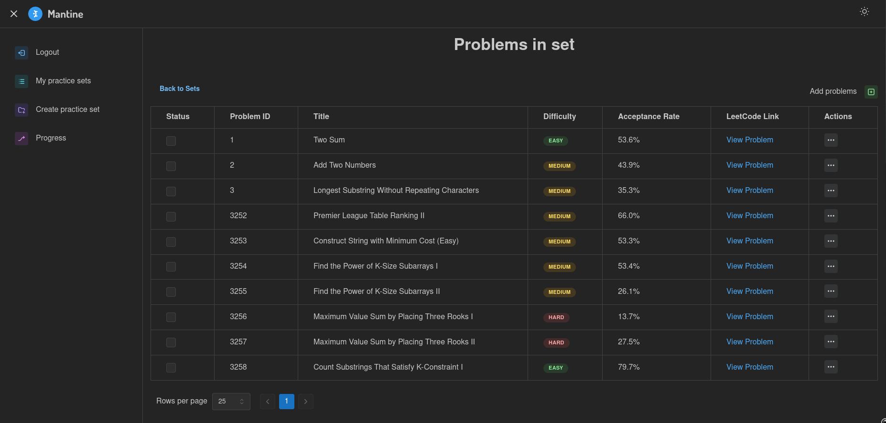

# LeetTracker 📚
LeetTracker is a full-stack web application designed for developers to efficiently organize and track their LeetCode journey. With LeetTracker, users can create custom sets of LeetCode problems, categorize them by difficulty or topic, and monitor their progress over time


## Technologies Used 🛠️
- Golang
- JavaScript
- React
- PostgreSQL
- Auth0
- Docker
- Redis
- GraphQL


## Setup Instructions 👨‍🏫

1. **Clone the Repository**
   ```sh
   git clone https://github.com/surgicalbear/LeetTracker.git
   cd LeetTracker
   ```

2. **Start Docker**

   Ensure Docker is installed and running:
   ```sh
   sudo systemctl start docker
   ```

4. **Set Up the Server**

   Navigate to the server directory and start the Docker container:
   ```sh
   cd server
   docker-compose up -d
   ```

   Start the Go server with live reloading:
   ```sh
   air
   ```

6. **Set Up the Frontend**

   Open a new terminal window, navigate to the web directory, and start the vite server:
   ```sh
   cd ../web
   npm install
   npm run dev
   ```

8. **Access the Application**

   Open your browser and visit:
   ```
   http://localhost:5173
   ```


## Demo 💡




